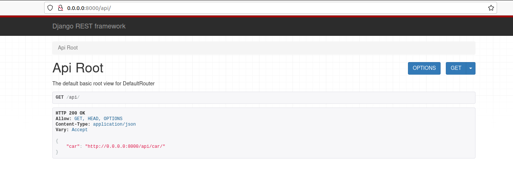
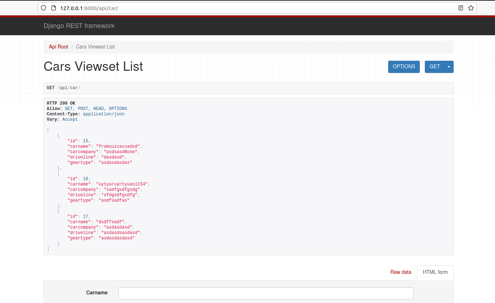
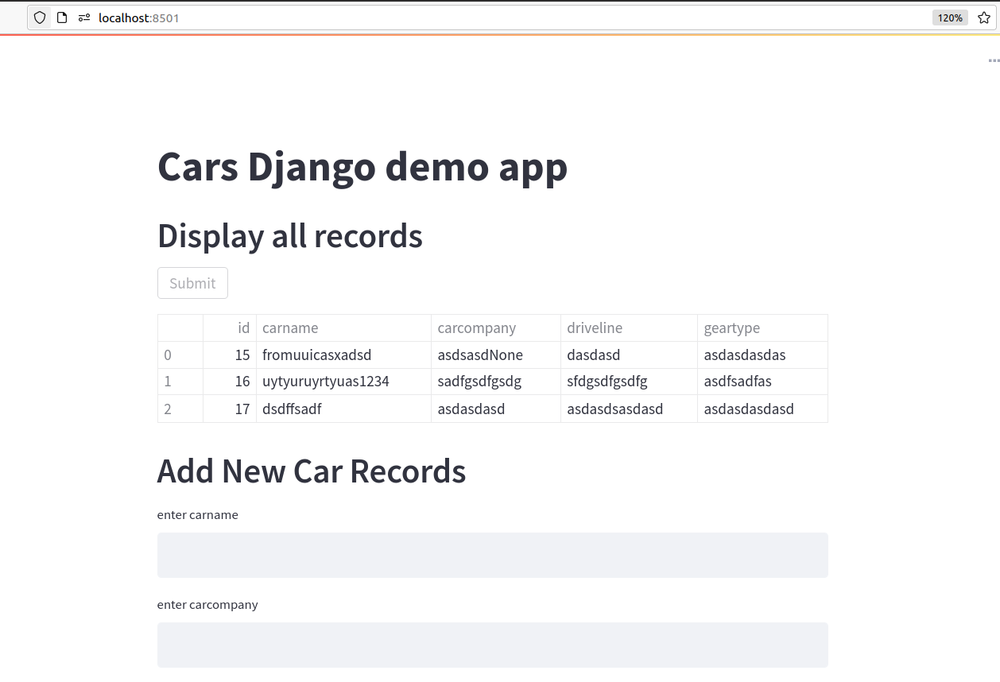

# Django CRUD REST API APP
A web application, using the Django REST framework to  provide REST APIs with CRUD principles.

## Method A:
Django,Django REST framework and database Postgres all in docker containers
## to run:
Install python, docker and docker compose

Unzip the Folder, go to dir that contain 'docker-compose.yaml'


```run docker-compose up```


## Method B:
Streamlit FE + Django connected to Postgres and Pgadmin which will run as docker containers
## to run:
Install python and docker


```clone the repo```

```run pip install -r requirements.txt```

```docker-compose up``` 

To run Postgres and Pgadmin as docker containers

Pgadmin will open in http://127.0.0.1:5051/

To Login enter following crends and create a connection,

```email - arun@gmail.com``` 

``pass - root```

To create connction - go to Add server

```connection - test``` 

```hostname - db```

```user - test``` 

```pass - admin```

```maintence db - testdb``` 

Create a connection

And Create a new db for application

```create DATABASE restfulapi``` 

To run django application, in dir the has manage.py, run the following

```python manage.py makemigrations```

```python manage.py migrate```

```python manage.py runserver```

Django api page will open in http://127.0.0.1:8000/api/car/



```run pip install -r requirements.txt```


## To run FE

In folder that contains frontend.py

```run run streamlit run frontend.py```




